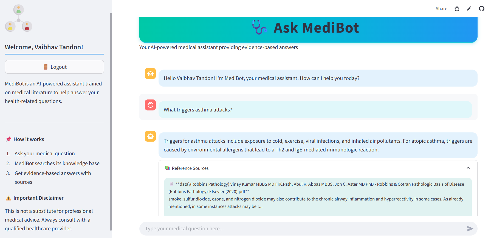
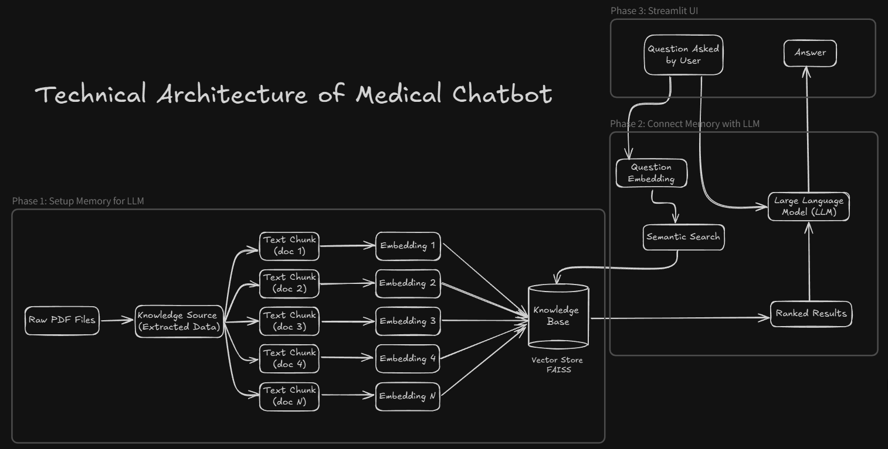

# 🩺 MediBot - AI-Powered Medical Assistant

 

MediBot is a secure, AI-powered web application that provides evidence-based answers to medical questions using state-of-the-art natural language processing technology. Built for patients seeking preliminary health information, it combines a user-friendly interface with robust medical knowledge retrieval.

## ✨ Key Features

- **Medical Q&A Assistant**: Get answers to health-related questions powered by Mistral-7B LLM
- **Evidence-Based Responses**: All answers include citations from medical literature
- **Secure Authentication**: User registration/login with session persistence
- **Medical-Themed UI**: Clean, professional interface designed for healthcare applications
- **Conversation History**: View and manage previous interactions
- **Source References**: Expandable citations for all provided information

## 🚀 Technology Stack

- **Frontend**: Streamlit
- **AI Models**: Hugging Face Transformers (Mistral-7B)
- **Vector Database**: FAISS
- **RAG Pipeline**: LangChain
- **Authentication**: SQLite with secure password hashing
- **Session Management**: Cookie-based with token verification

## ⚙️ Installation & Setup

### Prerequisites
- Python 3.8+
- [Hugging Face Access Token](https://huggingface.co/settings/tokens)
- Git

### Step-by-Step Installation

1. Clone the repository:
```bash
git clone https://github.com/yourusername/medibot.git
cd medibot
```
2. Create and activate virtual environment:
```bash
python -m venv venv
source venv/bin/activate  # Linux/Mac
venv\Scripts\activate    # Windows
```
3. Install dependencies:
```bash
pip install -r requirements.txt
```
4. Set up environment variables:
```bash
cp .env.example .env
```
- Edit the .env file with your:
    - HF_TOKEN (Hugging Face access token)
5. Run the application:
```bash
streamlit run app.py
```

## 🖥️ Usage
1. Create an account or login if you already have one
2. Type your medical question in the chat interface
3. Receive evidence-based answers with source citations
4. Review conversation history in the sidebar
5. Logout when finished

## ⚙️ Technical Architecture

 